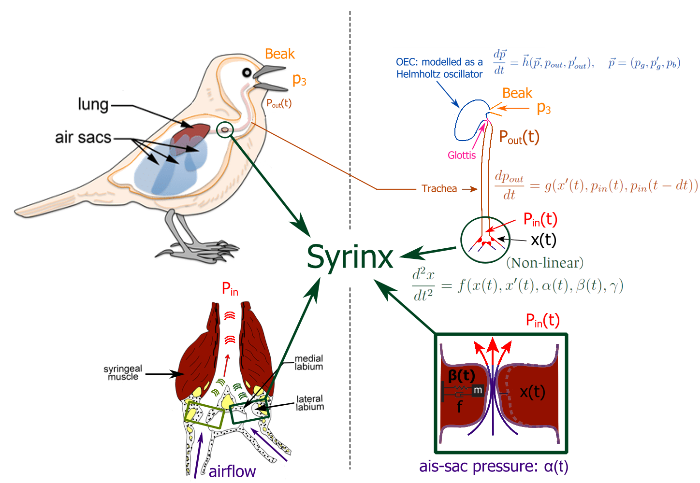
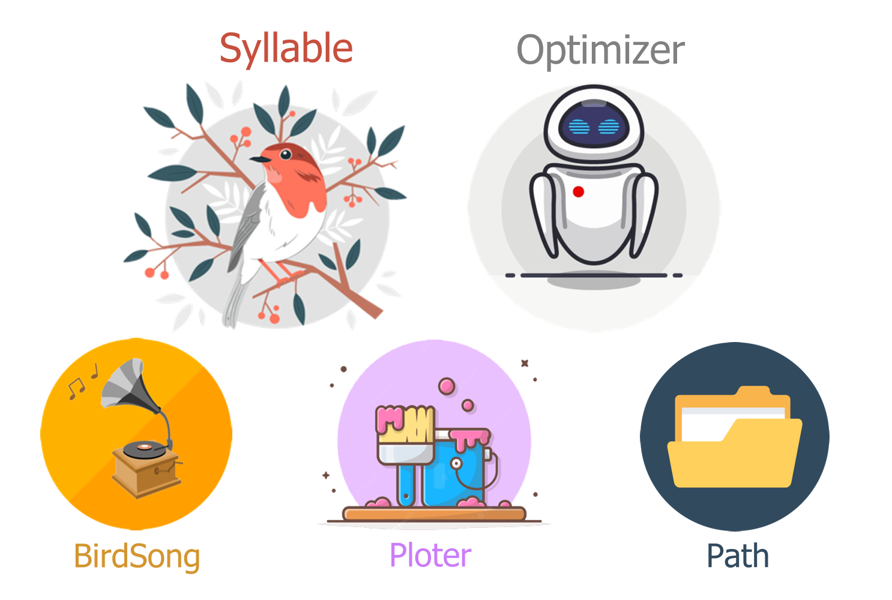
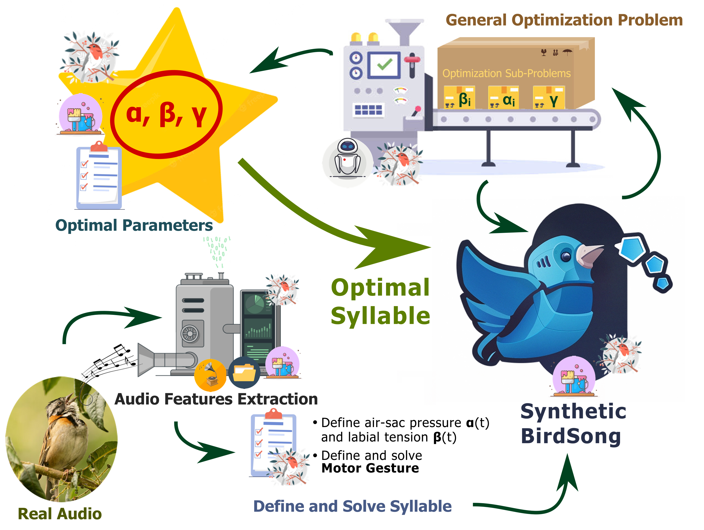

[](https://github.com/saguileran/birdsongs/)

# birdsongs

[](https://mybinder.org/v2/gh/saguileran/birdsongs/main?labpath=BirdSongs.ipynb)


#  Table of Contents

- [Installation](#Installation)
    - [Requirements](##Requirments)
    - [Downloading](##Downloading)
    - [Use](##Use)
- [Overview](#Overview)
- [Objective](#Objective)
- [Contents of the Repository](#Contents_of_the_Repository)
- [Results](#Results)
- [References](#References)
- [Audios References](##Audios_References)
---

# Installation

## Requirments

syllables requires:

- numpy
- matplotlib 
- scipy
- peakutils
- lmfit
- librosa
- scikit-maad
- sympy
- pandas
- sklearn
- IPython

## Downloading

In order to use birdsongs, clone the repository and enter to the folder repository

```bat
git clone https://github.com/saguileran/birdsongs.git
cd birdsongs
```
you can verify the current branch with the command `git branch -a`. You have to be in `main` branch, to change the branch use the command `git checkout main`.

The next step is to install the required packages, any of the following commands line will work

```bat
pip install -r ./birdsongs/requirements.txt
python -m pip install -r ./birdsongs/requirements.txt
cd birdsongs
```

the last step is to enter at the birdsongs folder to use its function with the examples audios.


## Use

### Define objects

Import the package as bs

```python
import birdsongs as bs
```

define a ploter and paths objects  

```python
ploter = bs.Ploter()
paths = bs.Paths()
```
define and plot the audio birdsong 

```python
NoFiles = 3
bird = bs.Song(paths, 3)
ploter.Plot(bird)
```

The last step is to define the syllable and optimizer objects to generate the synthetic dat 
```python
syllable  = bs.Syllable(bird.s, bird.fs)  # change to enter just bird
#optimizer = bs.Optimizer()
```


<!---
and then add to python 

```bat
pip install -e birdsongs
python -m pip install -e birdsongs
```
-->

# Overview


# Objective

Design, development, and evaluation of a physical model for generating synthetic birdsongs from recorded birdsongs


# Contents of the Repository

This repository have the documentation, scripts, and results delelop to achive the proposed objective.

The model used, Motor Gestures [1], have been developed by profesog G. Mindlin at the [Dynamical Systems Laboratory](http://www.lsd.df.uba.ar/) (in spanish LSD) of the university of Buenos Aires, Argentina. 

## Physical Model 

Schematic visualization of the complete Motod Gestures model: syrinx, trachea, glotis, and OEC. 

<p align="center"> </p>

## Programming Object Oriented (POO)

Taking advantege of the POO programming paradig, to avoid repeat long codes execution and easy reproducibility, five objects ared created:

- **Syllable**: define a object from audio syllable with its tempo and spectral features
- **Optimizer**: define a object to optimize function from method and syllables
- **Song**: define a object to read and split an audio song in syllables 
- **Plot**: define a object to plot real and synthec syllables or songs
- **Paths**: define a object to organize folders location

In order to understand the diagram methodology, the following icons will be used. 

<p align="center">  </p>

## Problem Solution and Implementation

Using the previous objects defined, the optimization problem is solved by following the next diagram 

<p align="center">  </p>

# Results

# References

<div class="csl-entry">[1] Amador, A., Perl, Y. S., Mindlin, G. B., &#38; Margoliash, D. (2013). Elemental gesture dynamics are encoded by song premotor cortical neurons. <i>Nature 2013 495:7439</i>, <i>495</i>(7439), 59–64. <a href="https://doi.org/10.1038/nature11967">https://doi.org/10.1038/nature11967</a></div>
<br>

<div class="csl-entry">[2] Newville, M., Stensitzki, T., Allen, D. B., &#38; Ingargiola, A. (2014). <i>LMFIT: Non-Linear Least-Square Minimization and Curve-Fitting for Python</i>. <a href="https://doi.org/10.5281/ZENODO.11813">https://doi.org/10.5281/ZENODO.11813</a></div>
<br>

<div class="csl-entry">[3] Ulloa, J. S., Haupert, S., Latorre, J. F., Aubin, T., &#38; Sueur, J. (2021). scikit-maad: An open-source and modular toolbox for quantitative soundscape analysis in Python. <i>Methods in Ecology and Evolution</i>, <i>12</i>(12), 2334–2340. https://doi.org/10.1111/2041-210X.13711</div>
<br>

<div class="csl-entry">[4] McFee, B., Raffel, C., Liang, D., Ellis, D. P., McVicar, M., Battenberg, E., & Nieto, O. &#38; (2015). librosa: Audio and music signal analysis in python. <i>  In Proceedings of the 14th python in science conference </i>, <i>12</i>(12), (Vol. 8). https://librosa.org/doc/latest/index.html</div>


## Audios References

- xeno-canto Sharing bird sounds from around the world 
    https://xeno-canto.org/species/Zonotrichia-capensis?dir=0&order=cnt&pg=19
- https://media.ebird.org/catalog?taxonCode=rucspa6&mediaType=audio
